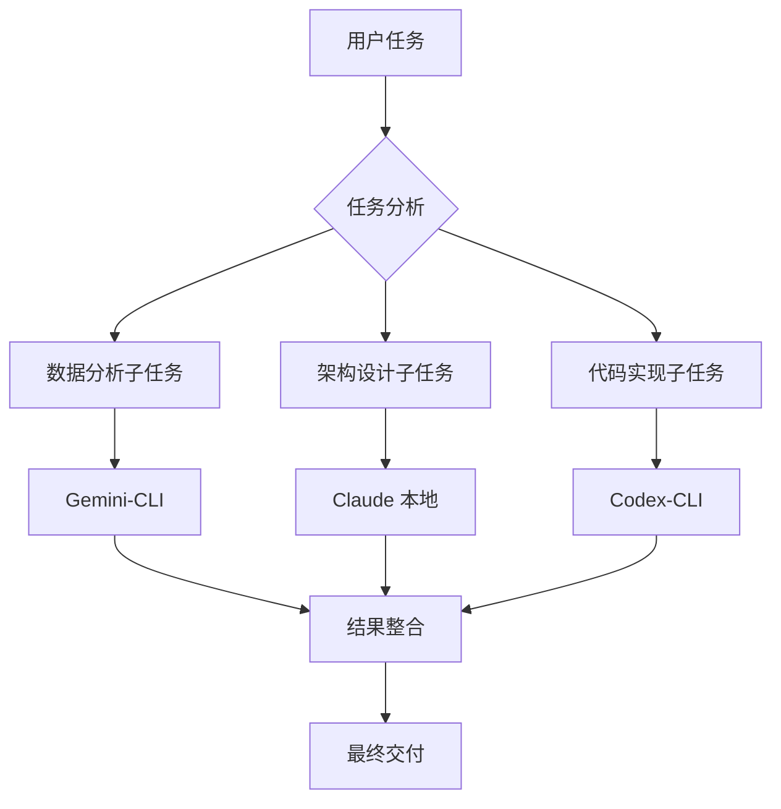

# Command: multi-ai-orchestrate

P1 Trading Builder 多 AI 协作编排命令 - 协调 Claude + Gemini + Codex 完成复杂开发任务

## 用法:
```bash
/multi-ai-orchestrate "复杂任务描述" [--phase analysis|design|implement|test|deploy]
```

## 编排策略:

### 自动任务分解

根据任务复杂度，自动分解为并行或串行的子任务：



### 并行执行模式

对于独立的子任务，同时调用多个 AI CLI：

```bash
# 示例：新交易所集成
# 1. Gemini 分析 API 数据格式
# 2. Claude 设计适配器架构
# 3. Codex 实现连接器代码
# 三个 AI 并行工作，最后 Claude 整合
```

## P1 复杂场景编排:

### 场景 1: 新 AI 功能开发
```bash
/multi-ai-orchestrate "开发基于强化学习的动态 Gate 阈值调整系统"

# 自动编排:
Phase 1 (并行):
├─ Gemini: 分析历史 Gate 性能数据，识别最优阈值模式
├─ Claude: 设计强化学习架构和训练流程
└─ Codex: 生成基础的 RL 环境和 Agent 框架

Phase 2 (串行):
├─ Claude: 整合 RL 架构到 P1 决策管道
├─ Codex: 实现训练脚本和评估工具
└─ Gemini: 验证 RL 模型的收敛性和稳定性

Phase 3 (验证):
└─ Claude: 集成测试 + 性能验证 + 文档编写
```

### 场景 2: 系统性能优化
```bash
/multi-ai-orchestrate "P1 系统端到端延迟优化，目标从 65ms 降至 45ms"

# 自动编排:
Phase 1 (分析):
├─ Gemini: 性能数据分析，识别延迟瓶颈分布
└─ Claude: 架构层面的优化策略设计

Phase 2 (实现):
├─ Codex: 生成优化后的关键路径代码
├─ Claude: 重构复杂的决策逻辑
└─ Gemini: 验证优化效果的统计显著性

Phase 3 (验证):
└─ Claude: 端到端性能测试 + 回归测试
```

### 场景 3: 新交易策略开发
```bash
/multi-ai-orchestrate "开发基于链上数据的 DeFi 套利机会检测策略"

# 自动编排:
Phase 1 (研究):
├─ Gemini: 分析链上数据模式，识别套利信号特征
├─ Claude: 设计套利检测算法和风险控制逻辑
└─ Codex: 生成链上数据获取和解析组件

Phase 2 (实现):
├─ Claude: 核心套利逻辑和 Gate 集成
├─ Codex: 实现数据连接器和实时监控
└─ Gemini: 回测验证和参数优化

Phase 3 (部署):
└─ Claude: 生产环境配置 + 监控仪表板
```

## 智能任务分发:

### 任务类型识别
```python
task_patterns = {
    "数据分析": ["分析", "统计", "计算", "验证", "回测", "评估"],
    "架构设计": ["设计", "架构", "流程", "策略", "整合", "协调"],  
    "代码实现": ["实现", "创建", "生成", "开发", "集成", "构建"],
    "性能优化": ["优化", "提升", "加速", "减少", "改进"],
    "测试验证": ["测试", "验证", "检查", "确保", "覆盖"]
}
```

### AI 特长匹配
```yaml
Gemini-CLI 优势:
  - 大数据量统计分析
  - 复杂数学模型验证
  - 市场模式识别
  - 性能指标计算

Codex-CLI 优势:
  - 快速代码生成
  - API 集成开发
  - 测试代码编写
  - 样板代码创建

Claude 优势:
  - 复杂系统架构
  - 业务逻辑设计
  - 错误处理策略
  - 技术文档编写
```

## 协作质量控制:

### 1. 输出标准化
每个 AI CLI 的输出都要符合 P1 标准：
- Gemini: JSON 格式 + 统计置信度
- Codex: 可运行代码 + 完整测试  
- Claude: 架构文档 + 集成指南

### 2. 交叉验证
- Gemini 的分析结果由 Claude 审查架构合理性
- Codex 的代码由 Claude 检查 P1 架构兼容性
- Claude 的设计由 Gemini 验证数学和统计正确性

### 3. 迭代优化
如果任一 AI 的输出不满足要求：
- 自动调整提示词重新执行
- 交叉引用其他 AI 的输出进行改进
- 最多 3 次迭代确保质量

## 使用示例:

```bash
# 复杂的 v2 功能开发
/multi-ai-orchestrate "开发多模态融合的 xLSTM 序列预测模型，集成到 P1 决策管道"

# 执行结果:
# ✅ Gemini: 分析时间序列特征重要性，优化模型参数
# ✅ Claude: 设计多模态融合架构，集成决策管道
# ✅ Codex: 实现 xLSTM 网络和训练脚本
# ✅ 最终: 完整的多模态预测系统 + 测试 + 文档
```

---

> 🎯 **多 AI 智能编排**: 让 Claude 协调 Gemini 和 Codex，实现真正的 AI 团队协作开发！
