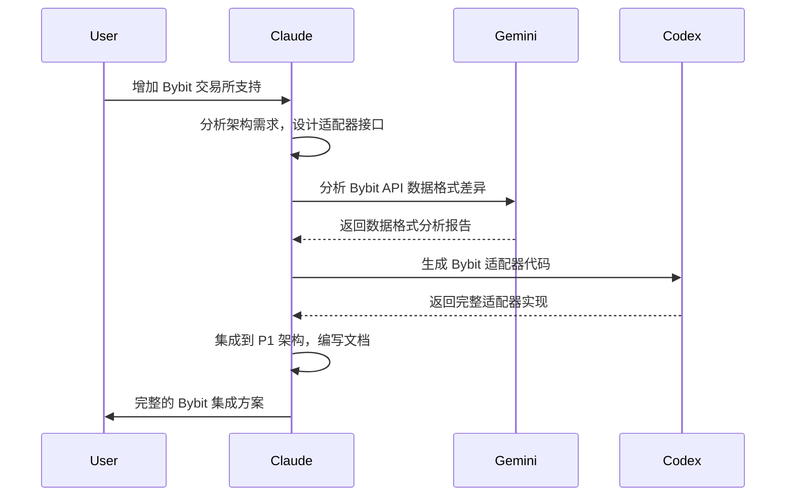
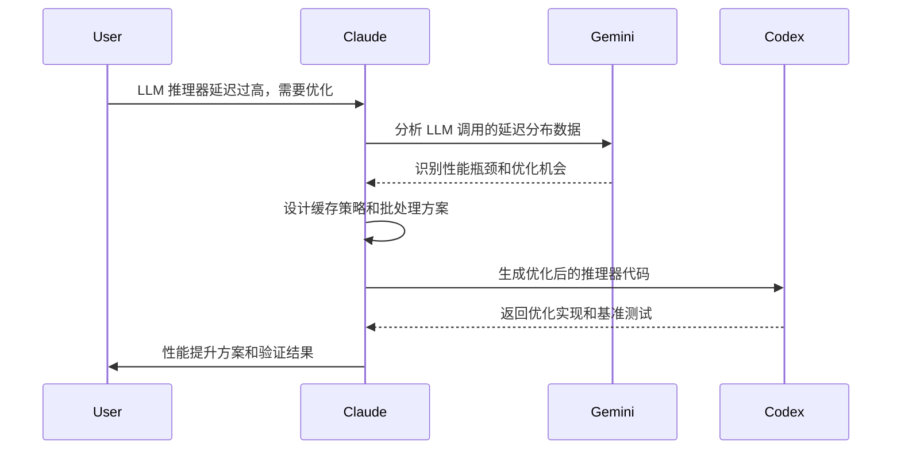

# P1 Trading Builder - Multi-AI CLI 协作配置

## 🤖 AI Agent 角色分配指南

这个配置文件定义了 P1 Overdrive-NS 项目中不同 AI CLI 工具的专业分工，实现多 AI 协作的高效开发流程。

### 核心理念
> **专业分工 + 协调配合** = 更高质量的金融交易系统开发

## 🎯 Agent 角色分配

### 1. **Claude (主协调器)**
**专长领域**: 系统架构设计、复杂逻辑实现、文档编写

```yaml
职责范围:
  - 🏗️ P1 系统架构设计和重构
  - 🧠 LLM Reasoner 和 AI 增强功能实现
  - 📊 复杂的金融算法 (CTFG, xLSTM, Conformal Prediction)
  - 🛡️ Gate 安全系统和风险控制逻辑
  - 📝 技术文档和 API 文档编写
  - 🔄 Context Engineering 和工作流优化

调用场景:
  - 设计新的 Gate 组件
  - 实现 LLM 推理器逻辑
  - 架构重构和性能优化
  - 复杂的异步处理和错误处理

输出格式:
  - 完整的代码实现
  - 详细的技术文档
  - 架构设计图和流程图
```

### 2. **Gemini-CLI (数据分析专家)**
**专长领域**: 数据处理、特征工程、量化分析

```yaml
职责范围:
  - 📊 市场数据分析和特征提取
  - 🔢 量化指标计算 (Z-score, 波动率, 相关性)
  - 📈 回测数据处理和性能评估
  - 🧮 数学模型验证和优化
  - 📋 数据可视化和报告生成

调用场景:
  - 分析新的市场指标有效性
  - 优化 Likert-7 编码算法
  - 验证 Conformal Prediction 覆盖率
  - 处理大规模历史数据分析

命令模式:
  # Claude 调用 Gemini 进行数据分析
  gemini-cli --prompt "分析 ETHUSDT 15m K线数据的波动率分布" --data features.json
  
输出要求:
  - 数值分析结果 (JSON 格式)
  - 统计图表和可视化
  - 量化指标解释
```

### 3. **Codex-CLI (代码生成专家)**  
**专长领域**: 快速原型开发、测试代码生成、API 集成

```yaml
职责范围:
  - ⚡ 快速 API 端点实现
  - 🧪 单元测试和集成测试生成
  - 🔌 第三方 API 集成 (交易所、数据源)
  - 🏃 简单业务逻辑和工具函数
  - 🔧 配置文件和脚本生成

调用场景:
  - 快速实现新的 DataHub 连接器
  - 生成完整的测试套件
  - 集成新的交易所 API
  - 创建开发和部署脚本

命令模式:
  # Claude 调用 Codex 生成代码
  codex-cli --task "实现 Binance WebSocket 连接器" --template fastapi_websocket
  
输出要求:
  - 立即可运行的代码
  - 完整的测试覆盖
  - 错误处理和重连逻辑
```

## 🔄 协作工作流

### 典型开发场景

#### 场景 1：新增加密货币交易所支持



#### 场景 2：优化 LLM 推理器性能



## 🛠️ 实现配置

### Claude 端配置增强

更新 `.claude/settings.local.json` 支持外部 CLI 调用：

```json
{
  "permissions": {
    "allow": [
      "Bash(gemini-cli:*)",
      "Bash(codex-cli:*)", 
      "Bash(python:*)",
      "Bash(pytest:*)",
      "Bash(grep:*)",
      "Bash(find:*)"
    ],
    "external_agents": {
      "gemini-cli": {
        "role": "data_analyst",
        "max_timeout": "30s",
        "cost_budget": "$5/day"
      },
      "codex-cli": {
        "role": "code_generator", 
        "max_timeout": "20s",
        "cost_budget": "$3/day"
      }
    }
  }
}
```

### 任务分发命令

创建自定义 Claude 命令支持 AI CLI 协作：

```markdown
# .claude/commands/multi-ai-analyze.md

基于任务类型自动分发给最适合的 AI CLI：

## 分发逻辑:
- 数据分析任务 → gemini-cli
- 代码生成任务 → codex-cli  
- 架构设计任务 → claude (本地)

## 使用方式:
/multi-ai-analyze "分析 ETHUSDT 波动率对 P1 决策准确性的影响"
```

## 📋 任务分配决策树

```
用户请求
    │
    ├─ 数据分析类 ────────────→ Gemini-CLI
    │  • 量化指标计算
    │  • 统计分析验证  
    │  • 回测性能评估
    │
    ├─ 代码实现类 ────────────→ Codex-CLI  
    │  • API 集成开发
    │  • 测试代码生成
    │  • 简单业务逻辑
    │
    └─ 架构设计类 ────────────→ Claude
       • 系统架构设计
       • 复杂算法实现
       • LLM 推理器逻辑
       • 文档和规范编写
```

## 🚀 P1 专用协作场景

### v2 AI 功能开发

1. **LLM Reasoner 优化**
   - Claude: 设计推理架构和边界触发逻辑
   - Gemini: 分析边界情况的统计分布
   - Codex: 生成优化后的推理器代码

2. **xLSTM 序列建模**
   - Claude: 设计多模态融合架构  
   - Gemini: 分析时间序列特征重要性
   - Codex: 实现 LSTM 层和注意力机制

3. **新 Gate 开发**
   - Claude: 设计 Gate 接口和安全逻辑
   - Gemini: 验证 Gate 阈值的统计有效性
   - Codex: 生成 Gate 实现和测试代码

### 性能优化工作流

1. **延迟瓶颈分析**
   - Gemini: 分析性能数据，识别瓶颈
   - Claude: 设计优化策略
   - Codex: 实现性能优化代码

2. **准确性提升**
   - Gemini: 分析预测误差分布  
   - Claude: 设计校准策略
   - Codex: 实现校准算法

## 💡 使用建议

### 何时使用多 AI 协作

- **复杂项目**：涉及数据分析 + 架构设计 + 代码实现
- **性能优化**：需要数据驱动的优化决策
- **新功能开发**：需要多角度验证和实现

### 协作最佳实践

1. **清晰的任务边界**：避免多个 AI 重复工作
2. **标准化输出格式**：确保 AI 间可以无缝协作
3. **版本控制**：每个 AI 的输出都要版本管理
4. **质量把关**：Claude 作为最终的质量检查者

---

> 🎯 **下一步**：我可以帮您实现具体的多 CLI 调用机制，让 Claude 能够协调 Gemini-CLI 和 Codex-CLI 来协助 P1 项目开发。您希望先从哪个使用场景开始？
